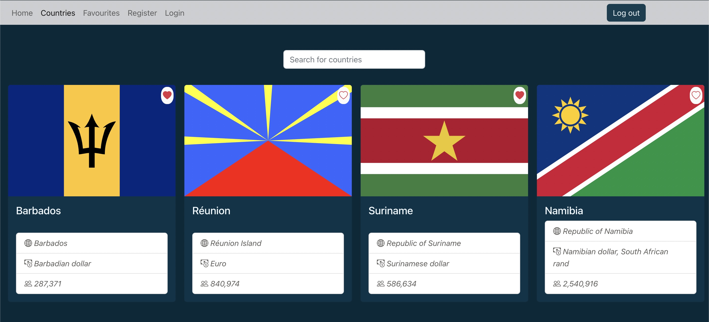
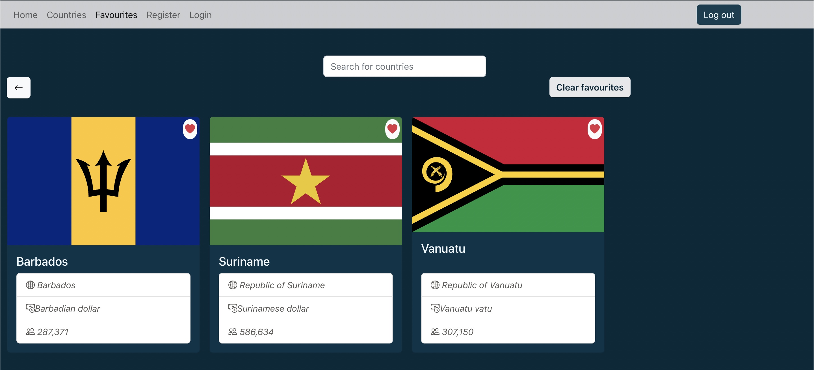

# Rest Countries App with Redux




## Technologies used

- React-Redux and React-Redux-Toolkit
- React-Bootstrap
- Axios
- [Open Weather Map](https://openweathermap.org/)
- [Firebase Authentication](https://firebase.google.com/)

### Features

- Browse all countries in the app with detalis
- Add and remove favourite countries
- Search any country name
- Navigate to different pages through the buttons and navbar

## How to run

Clone the repo and set up the project:

```
npm install
npm start 
```

App opens at http://localhost:3000 in browser.
